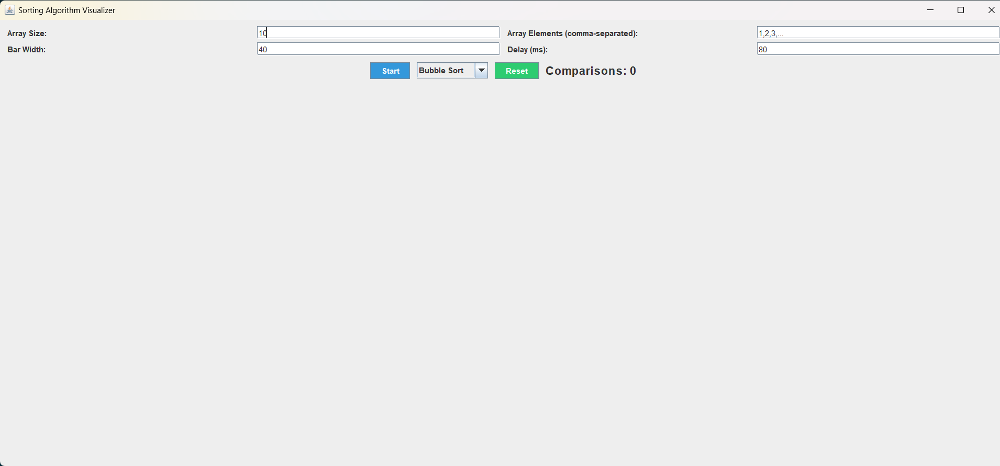
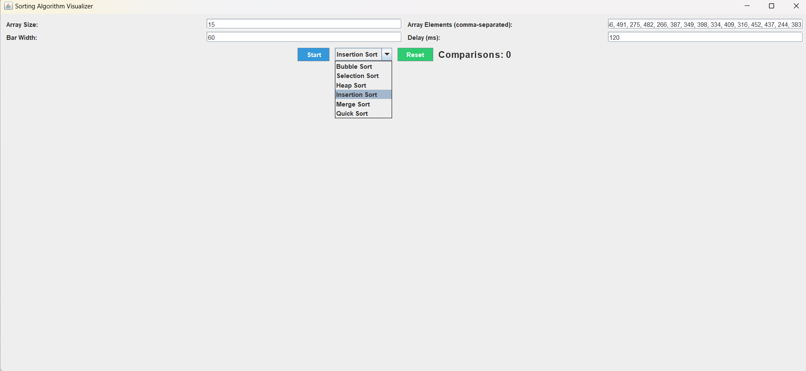
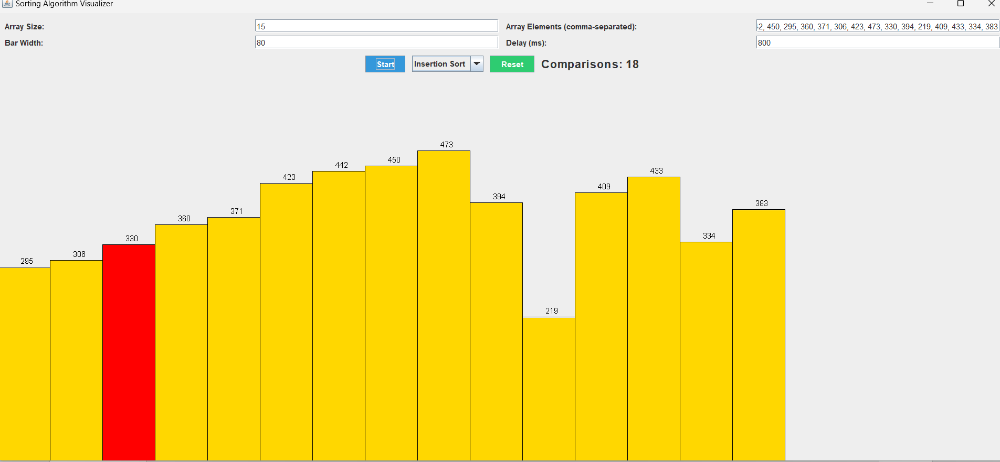
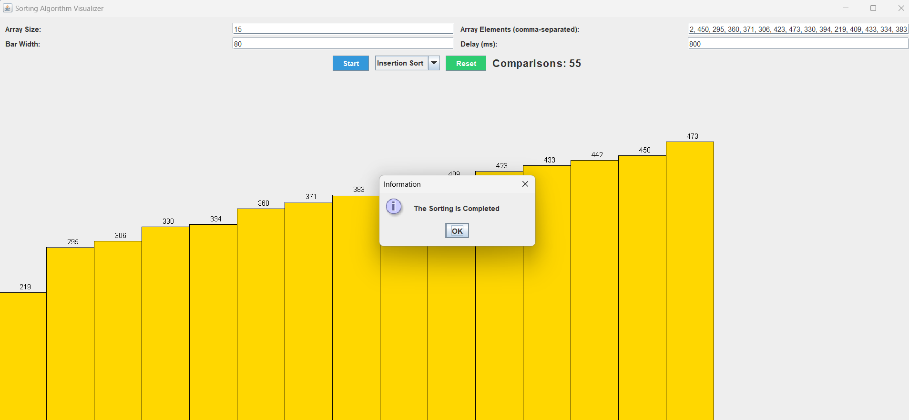

# Sorting Algorithm Visualizer

This Sorting Algorithm Visualizer is a Java application that provides a graphical representation of various sorting algorithms. With this tool, you can observe the step-by-step sorting process of algorithms like Bubble Sort, Selection Sort, Heap Sort, Insertion Sort, Merge Sort, and Quick Sort.

## Features
- Visualization of sorting algorithms: Bubble Sort, Selection Sort, Heap Sort, Insertion Sort, Merge Sort, Quick Sort.
- Customization options: Adjust array size, elements, bar width, and animation speed.
- Interactive interface built with Java Swing.
- Real-time tracking and display of comparison counts during sorting.
- Smooth animation powered by multithreading.

## Usage
1. Clone the repository to your local machine.
2. Compile and run the `SortingVisualizer.java` file.
3. Input your desired array size, elements, and animation settings.
4. Choose a sorting algorithm from the dropdown menu.
5. Click "Start" to begin visualization.
6. Enjoy watching the sorting process step by step!

## Example
## Output Window

## Select The Sorting Technique

## In Between The Sorting Process

## After The Sorting Is Completed

## Contributors
- [Your Name](https://github.com/DPRAHUL-2021)
